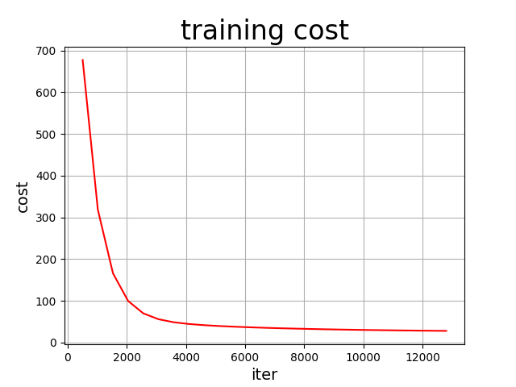
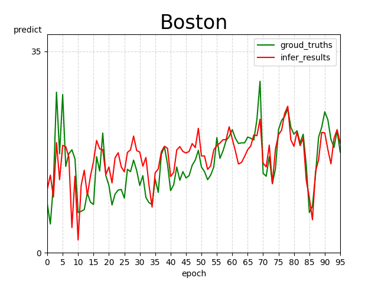
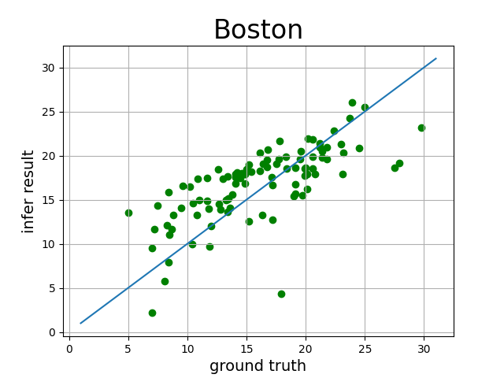
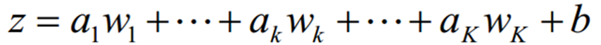
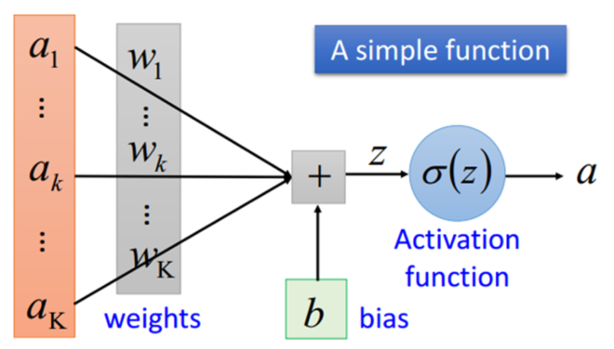

# 机器学习波士顿房价预测

## 环境
需要在自己的conda环境中安装百度飞桨的paddle软件包:

pip install paddlepaddle -i https://pypi.tuna.tsinghua.edu.cn/simple

## 运行结果

本次训练参数选择:BATCH_SIZE=512(批大小)  learning_rate=0.78(学习率)  EPOCH_NUM=25(训练轮数)

训练误差图:
 

真实房价与预测房价对比图:

真实房价与预测房价对比散点图:

# 一,实验目的
本实验的目的是通过对波士顿房价预测的机器学习模型建立和分析，探究以下几个方面：1.掌握机器学习的基本概念和技术：机器学习是一种基于数据的自动化学习技术，可以通过训练样本和算法来发现数据中的规律和模式，并预测新的数据。通过波士顿房价预测的机器学习模型，可以深入理解机器学习的基本概念和技术。2．实践机器学习算法的应用：机器学习算法是机器学习中最核心的部分，包括监督学习、无监督学习、强化学习等多种算法。在本实验中，需要选择合适的机器学习算法，并对其进行优化和调参，以实现对波士顿房价的精准预测。

房价预测是机器学习的一种应用领域，通过本实验可以了解机器学习在房价预测中的应用情况和局限性，以及如何优化模型提高预测准确率。总之，通过实现波士顿房价预测的机器学习模型，可以深入机器学习的基本概念和技术，实践机器学习算法的应用。
# 二,原理分析
线性回归是一种基本的统计学习方法，它试图用一个线性函数来拟合数据，以预测因变量与自变量之间的关系。在这种方法中，预测值是通过自变量的加权和来计算的。线性回归的基本假设是，因变量与自变量之间存在线性关系。这意味着，我们可以用一个线性方程来描述因变量与自变量之间的关系：y = b0 + b1x1 + b2x2 + ... + bnxn 。其中，y是因变量，x1到xn是自变量，b0到bn是回归系数。在进行线性回归分析时，我们需要找到最佳的回归系数，以最小化预测值与实际值之间的差异。这可以通过普通最小二乘法来实现，即最小化所有数据点的平方误差的和。平方误差是指预测值与实际值之间的差异的平方，这个平方的原因是为了避免正负差异相互抵消。

在实际应用中，线性回归模型需要对数据进行预处理，例如对自变量进行标准化和归一化处理，以确保各项自变量在数值上是相互可比的。此外，还需要进行自变量选择和模型调优，以提高模型的准确度和可靠性。线性回归模型是一种简单而有效的方法，它可以通过建立线性方程来描述因变量与自变量之间的关系，并通过最小化预测值与实际值之间的差异来寻找最佳回归系数。线性回归在数据分析、预测和决策分析等方面都有广泛的应用。

本实验还使用了PaddlePaddle Fluid的相关功能，PaddlePaddle Fluid是一种支持动态图和静态图混合编程的深度学习框架。它可以提供高效的分布式训练和推理功能，同时具有易于使用的API和丰富的预训练模型库。Fluid的设计目标是提高深度学习的生产力和效率，并为用户提供快速、可扩展、易用的机器学习平台。

Fluid框架的核心是计算图，通过使用计算图，用户可以轻松地定义和优化深度学习模型。Fluid框架还支持多种优化算法，例如梯度下降、Adam、Momentum，SGD等，这些算法可以帮助用户更快地训练深度学习模型。Fluid是一种支持动态图和静态图混合编程的深度学习框架，它可以提供高效的分布式训练和推理功能，并为用户提供易于使用的API和丰富的预训练模型库，以提高深度学习的生产力和效率。

# 三,处理步骤
波士顿房价预测数据处理步骤包括以下几个步骤：
## Step1：准备数据集
该数据集包含506个样本，每个样本包含13个特征和一个房价的目标值。这些特征包括：
1. CRIM：城镇人均犯罪率。
2. ZN：住宅用地占地面积超过25,000平方英尺的比例。
3. INDUS：城镇中非零售业务的比例。
4. CHAS：是否靠近Charles River（1表示是，0表示否）。
5. NOX：一氧化氮浓度（每千万分之一）。
6. RM：每个住房的平均房间数。
7. AGE：建于1940年之前的业主自住房屋的比例。
8. DIS：距离波士顿五个就业中心的加权距离。
9. RAD：径向公路可达性的指数。
10. TAX：每10,000美元的全额物业税率。
11. PTRATIO：城镇中学生与教师比例。
12. B：1000（Bk - 0.63）^ 2，其中Bk是城镇黑人的比例。
13. LSTAT：低收入人群比例。
    
获取数据集之后，就要对所有的特征进行分析和筛选，选择出对预测结果有重要影响的特征。因为波士顿房价预测数据集本身数据量较小，计算机算力足够。因此将13个数据特征都作为被选择特征。然后是数据集划分，将数据集划分为训练集、验证集和测试集，其中训练集用于模型训练，验证集用于模型选择和调整，测试集用于模型评估。

## Step2:网络配置
首先是网络搭建，对于线性回归来讲，它就是一个从输入到输出的简单的全连接层。 对于波士顿房价数据集，假设属性和房价之间的关系可以被属性间的线性组合描述。 
   

其次是，定义损失函数，此次使用均方差损失函数square_error_cost(input,lable):接受输入预测值和目标值，并返回方差估计,即为（y-y_predict）的平方。

最后，定义优化函数，此次使用的是随机梯度下降。

